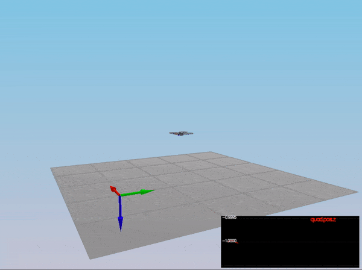
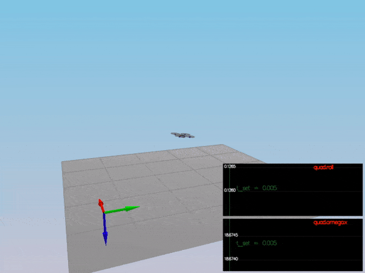
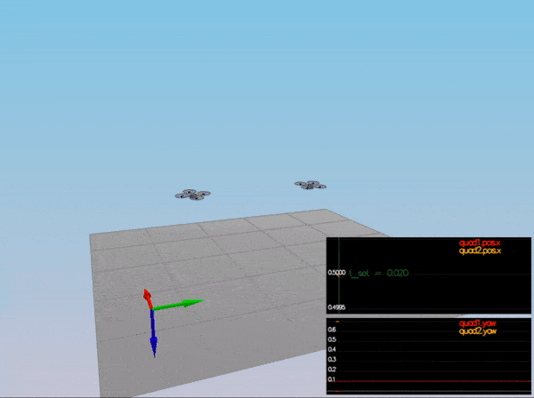
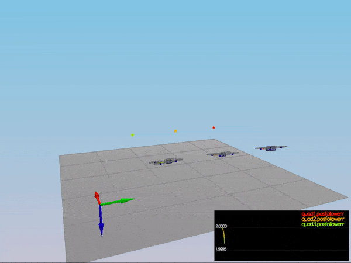
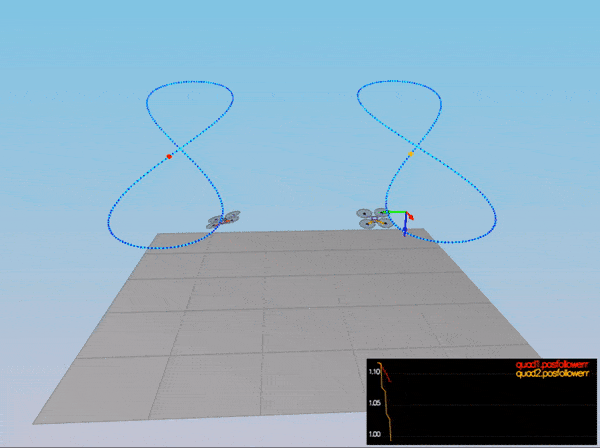
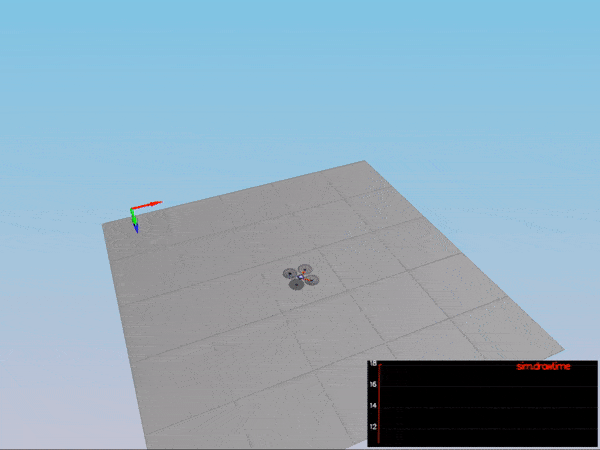

# Quadrotor Controls

---

### Udacity Flying Car and Autonomous Flight Engineer Nanodegree

 - [Development environment setup](#development-environment-setup)
 - [Simulator walkthrough](#simulator-walkthrough)
 - [Project Rubric] (#project-rubric)
 - [Future Work] (#future-work)

## Development Environment Setup ##

Regardless of your development platform, the first step is to download or clone this repository.

Once you have the code for the simulator, you will need to install the necessary compiler and IDE necessary for running the simulator.

Here are the setup and install instructions for each of the recommended IDEs for each different OS options:

### Windows ###

For Windows, the recommended IDE is Visual Studio.  Here are the steps required for getting the project up and running using Visual Studio.

1. Download and install [Visual Studio](https://www.visualstudio.com/vs/community/)
2. Select *Open Project / Solution* and open `<simulator>/project/Simulator.sln`
3. From the *Project* menu, select the *Retarget solution* option and select the Windows SDK that is installed on your computer (this should have been installed when installing Visual Studio or upon opening of the project).
4. Make sure platform matches the flavor of Windows you are using (x86 or x64). The platform is visible next to the green play button in the Visual Studio toolbar:


5. To compile and run the project / simulator, simply click on the green play button at the top of the screen.  When you run the simulator, you should see a single quadcopter, falling down.


### OS X ###

For Mac OS X, the recommended IDE is XCode, which you can get via the App Store.

1. Download and install XCode from the App Store if you don't already have it installed.
2. Open the project from the `<simulator>/project` directory.
3. After opening project, you need to set the working directory:
  1. Go to *(Project Name)* | *Edit Scheme*
  2. In new window, under *Run/Debug* on left side, under the *Options* tab, set Working Directory to `$PROJECT_DIR` and check ‘use custom working directory’.
  3. Compile and run the project. You should see a single quadcopter, falling down.


### Linux ###

For Linux, the recommended IDE is QtCreator.

1. Download and install QtCreator.
2. Open the `.pro` file from the `<simulator>/project` directory.
3. Compile and run the project (using the tab `Build` select the `qmake` option.  You should see a single quadcopter, falling down.

**NOTE:** You may need to install the GLUT libs using `sudo apt-get install freeglut3-dev`

## Simulator Walkthrough ##

Now that you have all the code on your computer and the simulator running, let's walk through some of the elements of the code and the simulator itself.

### The Code ###

For the project, the majority of your code will be written in `src/QuadControl.cpp`.  This file contains all of the code for the controller that you will be developing.

All the configuration files for your controller and the vehicle are in the `config` directory.  For example, for all your control gains and other desired tuning parameters, there is a config file called `QuadControlParams.txt` set up for you.  An import note is that while the simulator is running, you can edit this file in real time and see the affects your changes have on the quad!

The syntax of the config files is as follows:

 - `[Quad]` begins a parameter namespace.  Any variable written afterwards becomes `Quad.<variablename>` in the source code.
 - If not in a namespace, you can also write `Quad.<variablename>` directly.
 - `[Quad1 : Quad]` means that the `Quad1` namespace is created with a copy of all the variables of `Quad`.  You can then overwrite those variables by specifying new values (e.g. `Quad1.Mass` to override the copied `Quad.Mass`).  This is convenient for having default values.

You will also be using the simulator to fly some difference trajectories to test out the performance of your C++ implementation of your controller. These trajectories, along with supporting code, are found in the `traj` directory of the repo.


### The Simulator ###

In the simulator window itself, you can right click the window to select between a set of different scenarios that are designed to test the different parts of your controller.

The simulation (including visualization) is implemented in a single thread.  This is so that you can safely breakpoint code at any point and debug, without affecting any part of the simulation.

Due to deterministic timing and careful control over how the pseudo-random number generators are initialized and used, the simulation should be exactly repeatable. This means that any simulation with the same configuration should be exactly identical when run repeatedly or on different machines.

Vehicles are created and graphs are reset whenever a scenario is loaded. When a scenario is reset (due to an end condition such as time or user pressing the ‘R’ key), the config files are all re-read and state of the simulation/vehicles/graphs is reset -- however the number/name of vehicles and displayed graphs are left untouched.

When the simulation is running, you can use the arrow keys on your keyboard to impact forces on your drone to see how your controller reacts to outside forces being applied.

#### Keyboard / Mouse Controls ####

There are a handful of keyboard / mouse commands to help with the simulator itself, including applying external forces on your drone to see how your controllers reacts!

 - Left drag - rotate
 - X + left drag - pan
 - Z + left drag - zoom
 - arrow keys - apply external force
 - C - clear all graphs
 - R - reset simulation
 - Space - pause simulation

## Project Rubric ##

### Writeup
This README includes all the rubric points and how I addressed each one. 

### Implemented Controller

###### Implemented body rate control
The body rate controller is implemented as a P controller while applying the moments of inertia. This is shown in the code block below:

``` C++
V3F rate_error = pqrCmd - pqr;
V3F ubar = kpPQR * rate_error;

momentCmd = ubar * V3F(Ixx, Iyy, Izz);
```

###### Implement roll-pitch control
The following equations were used to implement to `roll-pitch` controller:

<p align="center">

</p>

Elementes `R13` and `R23` of the rotation matrix from body-frame accelerations and world frame accelerations are implemented as a P controller. 

The following equation was also applied to allow the output to be in terms of roll and pitch rates: 

<p align="center">

</p>

The implementation of these equations can be seen in the code block below:

``` C++
if(collThrustCmd > 0) {
	float c = -collThrustCmd / mass;
	float b_x_cmd = CONSTRAIN(accelCmd.x / c, -maxTiltAngle, maxTiltAngle);
	float b_x_err = b_x_cmd - R(0,2);
	float b_x_p = kpBank * b_x_err;

	float b_y_cmd = CONSTRAIN(accelCmd.y / c, -maxTiltAngle, maxTiltAngle);
	float b_y_err = b_y_cmd - R(1,2);
	float b_y_p = kpBank * b_y_err;

	pqrCmd.x = (R(1,0) * b_x_p - R(0,0) * b_y_p / R(2,2));
	pqrCmd.y = (R(1,1) * b_x_p - R(0,1) * b_y_p / R(2,2));
}
else {
	pqrCmd.x = 0.0;
	pqrCmd.y = 0.0;
}

pqrCmd.z = 0.0;
```

###### Implement altitude controller
The following equations were used to implement to `altitude` controller:

<p align="center">

</p>

The `altitude` controller is a PD controller to control the acceleration, or thrust, needed to adjust the quad's altitude. The implementation can be seen in the code block below:

``` C++
float z_err = posZCmd - posZ;
float p = kpPosZ * z_err;
    
float z_dot_err = velZCmd - velZ;
integratedAltitudeError += z_err * dt;

float d = kpVelZ * z_dot_err + velZ;
float i = KiPosZ * integratedAltitudeError;
float b_z = R(2,2);
  
float u_1_bar = p + i + d + accelZCmd;
  
float acc = (u_1_bar - CONST_GRAVITY) / b_z;
  
thrust = -mass * CONSTRAIN(acc, -maxAscentRate/dt, maxAscentRate/dt);
```

###### Implement lateral position control
The `lateralPosition` controller is another PID controller that controls acceleration along the x and y axis. The implementation is shown in the code block below:

``` C++
V3F kpPos;
kpPos.x = kpPosXY;
kpPos.y = kpPosXY;
kpPos.z = 0.f;
 
V3F kpVel;
kpVel.x = kpVelXY;
kpVel.y = kpVelXY;
kpVel.z = 0.f;
  
V3F maxVelCmd;
if(velCmd.mag() > maxSpeedXY) {
	maxVelCmd = velCmd.norm() * maxSpeedXY;
}
else {
	maxVelCmd = velCmd;
}
    
accelCmd = kpPos * (posCmd - pos) + kpVel * (maxVelCmd - vel) + accelCmd;
    
if(accelCmd.mag() > maxAccelXY) {
	accelCmd = accelCmd.norm() * maxAccelXY;
}
```

###### Implement yaw control
The `yaw` controller is another P controller that optimizes the quad's yaw between -pi and pi. The implementation can be seen in the code block below:

``` C++
float yaw_err = 0;
if(yawCmd > 0) {
	yaw_err = fmodf(yawCmd, 2*F_PI) - yaw;
}
else {
	yaw_err = -fmodf(yawCmd, 2*F_PI) -yaw;
}
  
if(yaw_err > F_PI) {
	yaw_err -= 2*F_PI;
}
if(yaw_err < -F_PI) {
	yaw_err += 2*F_PI;
}
  
yawRateCmd = kpYaw * yaw_err;
```


###### Implement calculating the motor commands given commanded thrust and moments

The following equations were used to implement `generateMotorCommands`:

<p align="center">

</p>

Where `F_1` to `F_4` represents the target thrust of each motor, `tao(x, y, z)` are the moments in each direction, `F_t` is the total thrust, `kappa` is the drag/thrust ratio, and `l` is the drone arm length over the square root of two. 

The code to implement the motor commands is shown in the code block below:

``` C++
float l = L / sqrtf(2.f);
float targetx = momentCmd.x / l;
float targety = momentCmd.y / l;
//The z axis points down, so the z moment must be inverted
float targetz = -momentCmd.z / kappa;

// targetx is positive on the left side of the quadrotor to allow for clockwise roll
// targety is positive on the front of the quadrotor to allow for clockwise pitch
// targetz is positive on the clockwise spinning rotors and negative on the counter-clockwise spinning rotors
// the target collective thrust is applied evenly across all motors
cmd.desiredThrustsN[0] = (targetx + targety + targetz + collThrustCmd)/ 4.f; // front left -
cmd.desiredThrustsN[1] = (-targetx + targety - targetz + collThrustCmd)/ 4.f; // front right
cmd.desiredThrustsN[2] = (targetx - targety - targetz + collThrustCmd)/ 4.f; // rear left
cmd.desiredThrustsN[3] = (-targetx - targety + targetz + collThrustCmd)/ 4.f; // rear right
```


### Flight Evaluation
My C++ controller is successfully able to fly the provided test trajectory and visually passes inspection of the scenarios leading up to the test trajectory. Each scenario's results are shown below:

###### Scenario 1 - Hover
<p align="center">

</p>

```
PASS: ABS(Quad.PosFollowErr) was less than 0.500000 for at least 0.800000 seconds
```

###### Scenario 2 - Altitude Control
<p align="center">

</p>

```
PASS: ABS(Quad.Roll) was less than 0.025000 for at least 0.750000 seconds
PASS: ABS(Quad.Omega.X) was less than 2.500000 for at least 0.750000 seconds
```

###### Scenario 3 - Position Control
<p align="center">

</p>

```
PASS: ABS(Quad1.Pos.X) was less than 0.100000 for at least 1.250000 seconds
PASS: ABS(Quad2.Pos.X) was less than 0.100000 for at least 1.250000 seconds
PASS: ABS(Quad2.Yaw) was less than 0.100000 for at least 1.000000 seconds
```

###### Scenario 4 - Nonidealiarlities
<p align="center">

</p>

```
PASS: ABS(Quad1.PosFollowErr) was less than 0.100000 for at least 1.500000 seconds
PASS: ABS(Quad2.PosFollowErr) was less than 0.100000 for at least 1.500000 seconds
PASS: ABS(Quad3.PosFollowErr) was less than 0.100000 for at least 1.500000 seconds
```

###### Scenario 5 - Trajectory Follow
<p align="center">

</p>

```
PASS: ABS(Quad2.PosFollowErr) was less than 0.250000 for at least 3.000000 seconds
```

###### Scenario X - Test Many Quads
<p align="center">

</p>


## Future Work ##

### Extra Challenge 1 ###

You will notice that initially these two trajectories are the same. Let's work on improving some performance of the trajectory itself.

1. Inspect the python script `traj/MakePeriodicTrajectory.py`.  Can you figure out a way to generate a trajectory that has velocity (not just position) information?

2. Generate a new `FigureEightFF.txt` that has velocity terms
Did the velocity-specified trajectory make a difference? Why?

With the two different trajectories, your drones' motions should look like this:

<p align="center">

</p>


### Extra Challenge 2 ###

For flying a trajectory, is there a way to provide even more information for even better tracking?

How about trying to fly this trajectory as quickly as possible (but within following threshold)!